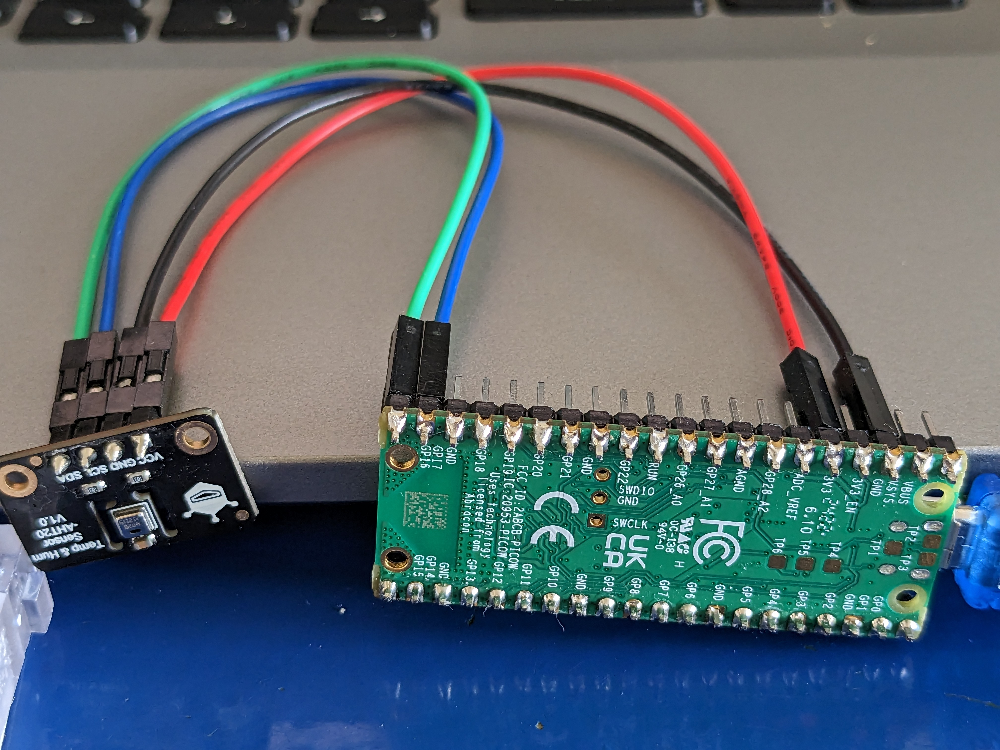

# DFRobot_AHT20_MicroPython
This is a port of https://github.com/DFRobot/DFRobot_AHT20 for Micropython on the Raspberry Pico.

The AHT20 temperature & humidity sensor employs digital output and I2C interface, through which users can read the measured temperature and humidity. Based on the AHT20 chip, it offers the following features:

* Collect ambient temperature, unit Celsius (℃), range -40-85℃, resolution: 0.01, error: ±0.3-±1.6 ℃
* Collect ambient relative humidity, unit: %RH, range 0-100%RH, resolution 0.024%RH, error: when the temprature is 25 ℃, error range is ±2-±5%RH
* Use I2C interface, I2C address default to be 0x38
* uA level sensor, the measured value is up to 200uA.
* Power supply range 3.3-5V

## Usage

Connect the DFRobot AHT20 as follows:
* VCC to 3V3
* GND to GND
* SCL to GP17
* SDA to GP16

Using e.g. [Thonny](https://thonny.org/), upload `DFRobot_AHT20.py` and `main.py` onto the Raspberry Pico. Run `main.py`. 